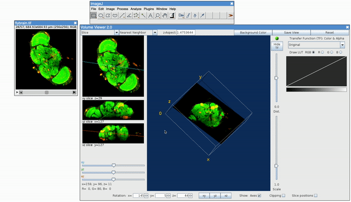
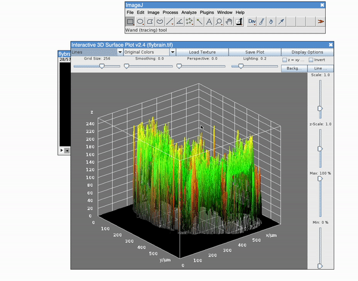
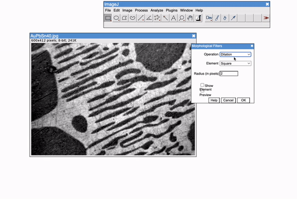
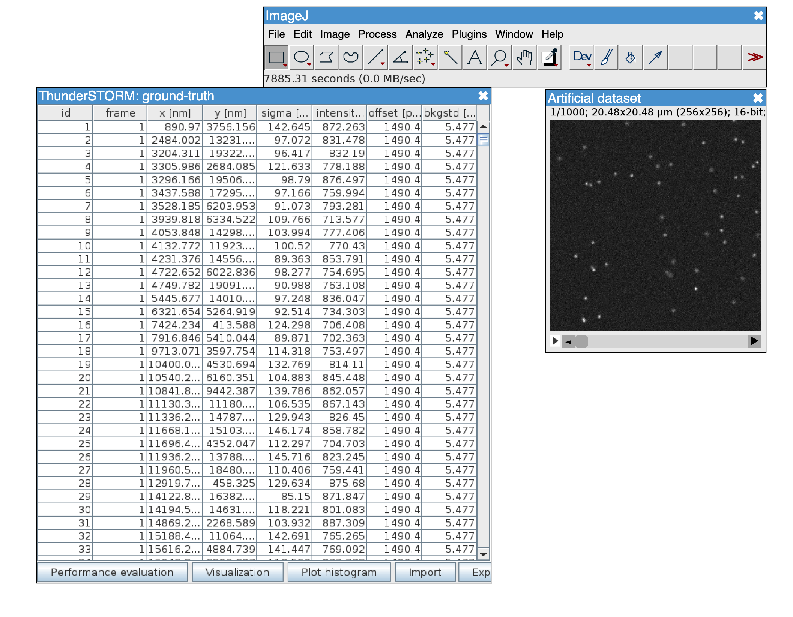

[ImageJ](https://imagej.nih.gov/ij/), a renowned open-source image processing tool, has long been a familiar name in the scientific community. Seeking to build upon its rich legacy, we undertook an ambitious endeavor: to transition ImageJ to the web through [ImageJ.JS](https://ij.imjoy.io). The outcome? An unequivocal triumph. ImageJ.JS has captivated a global audience, attracting over 1,000 users daily. The ability to run ImageJ on mobile devices and iPads has been particularly celebrated, offering users a newfound flexibility and accessibility in their work.

## A Brief Look Back

The creation of [ImageJ.JS](https://ij.imjoy.io) originated from a desire to bring the robust capabilities of the ImageJ image analysis tool directly to web browsers. In the initial stages, we utilized compilers such as [CheerpJ](https://leaningtech.com/cheerpj/) to facilitate this transition. This process entailed converting Java Archive (`.jar`) files into JavaScript (`.jar.js`) files, thereby enabling the execution of Java applications in browsers without necessitating plugins.

However, despite these efforts, we encountered several hurdles:

- **File Size Limitations**: The web-based environment imposed constraints on loading large datasets, restricting us to files smaller than 4GB.
- **Lack of Multi-threading Support**: The absence of multi-threading capabilities limited the performance and speed of computations.
- **Plugin Integration Challenges**: Incorporating and compiling ImageJ plugins into the web version was a complex task, often requiring extensive adjustments to ensure compatibility.

To address these issues, we initiated a [fork of the ImageJ project on GitHub](https://github.com/imjoy-team/imageja.js). Here, we explored solutions to bypass the aforementioned constraints and enhance functionality. By delving into the source code, we aimed to optimize ImageJ.JS for smoother and more efficient performance in web environments.

## Elevating ImageJ.JS

Determined to enhance [ImageJ.JS](https://ij.imjoy.io), our team actively sought out cutting-edge solutions that could refine the user experience and expand its capabilities. Recently, [the launch of the updated CheerpJ compiler 3](https://labs.leaningtech.com/blog/announcing-cheerpj-3) provided a promising avenue for exploration.

This new version of [CheerpJ](https://leaningtech.com/cheerpj/) introduced several transformative features. Notably, the new JIT compilation support eliminated the necessity for an intermediate compilation step, which had previously been a cumbersome phase in the deployment process. Instead, the updated CheerpJ allows `.jar` files, originally constructed for a standard Java Virtual Machine (JVM), to be loaded directly into the browser. It also support full classloader which makes it easier to dynamically load jar files. This innovation significantly streamlined the process of bringing Java applications into web environments.

So, what implications does this have for ImageJ.JS?

- **Streamlined Plugin Integration**: The ability to load `.jar` files directly paves the way for easier integration with ImageJ's vast plugin ecosystem. Users can now anticipate smoother, more straightforward implementations of plugins, enhancing the versatility of ImageJ.JS.
- **Dynamic Patching Capabilities**: The updated CheerpJ facilitates dynamic patching, wherein we can swiftly adapt and modify functions to align with web-specific requirements. This provides a seamless transition between traditional desktop applications and web environments, ensuring consistent user experience across platforms.

Upon delving deep into the capabilities of the updated CheerpJ, we were encouraged by the initial results. Enhancements in the speed and efficiency of certain functions were evident, and the newfound ease of integration marked a significant step forward.

Here is how the 3D volume viewer looks like in the new ImageJ.JS:

And the 3D surface plot:

Without any compilation step, we can for example, directly load the MorpholibJ plugin and run it inside ImageJ.JS:

However, we recognize that this is an ongoing journey of optimization and exploration. Our team continues to probe the possibilities and potential improvements, committed to elevating ImageJ.JS to its utmost potential.

## The Future of ImageJ.JS

ImageJ.JS's popularity isn't just in numbers. Its adaptability on platforms like mobiles and iPads has won users' hearts. With this enthusiasm, we are even more committed to refining the experience.

Next steps include:

- Fix the file loading with the hope of support files larger than the memory
- Evaluating file chooser integration and potential mapping with our elFinder plugin.
- Envisioning a browser version of Fiji with a robust plugin system, enabling most ImageJ plugins to be used directly in ImageJ.JS.

In wrapping up, ImageJ.JS represents the convergence of a powerful legacy tool with modern technological adaptability. As we push its boundaries, we're excited about its potential to further transform scientific image analysis on the web.

## Acknowledgments

We thank Curtis Rueden for his support and guidance in the development of ImageJ.JS, we also thank Leaning Technologies for providing us the compiler which makes it possible to run ImageJ in the browser.
